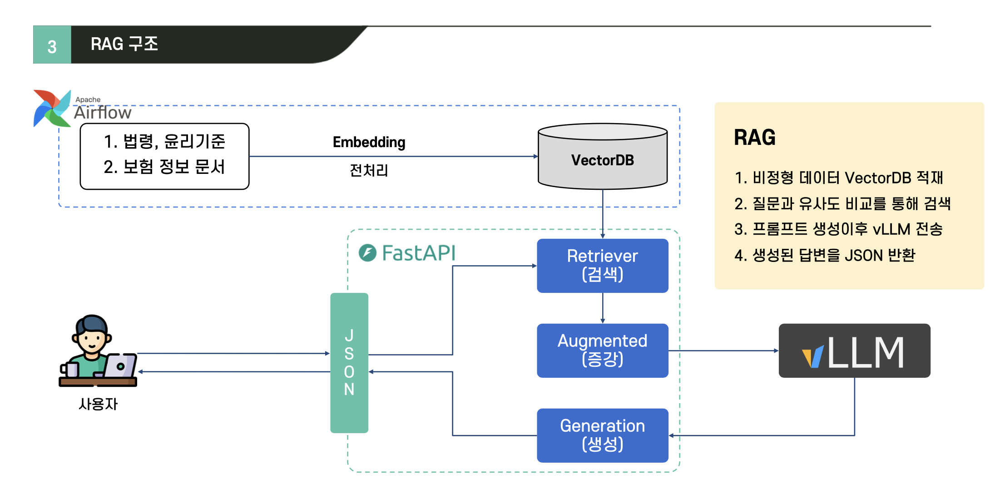
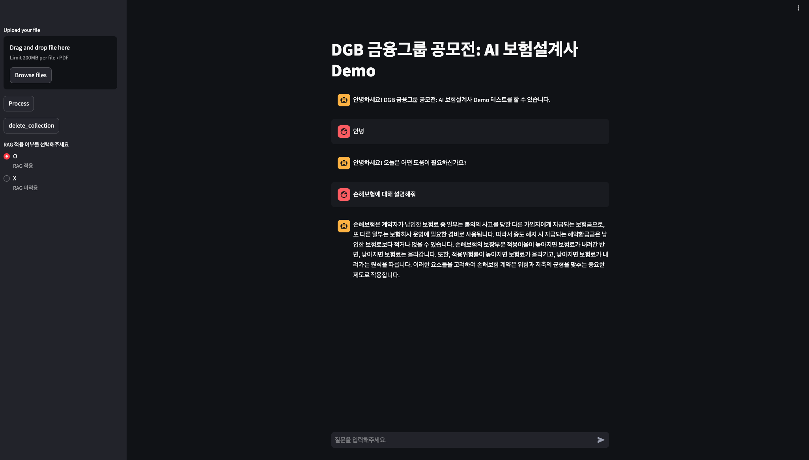

# DGB IT`s DGB, iM Challenger
## **대회 멤버**

<table>
 <tr>
    <td align="center"><a href="https://github.com/DoxB"></td>
    <td align="center"><a href="https://github.com/eunhyea"></td>
    <td align="center"><a href="https://github.com/juyeon0312"></td>
  </tr>
  <tr>
    <td align="center"><a href="https://github.com/DoxB"><b>임정규</b></td>
    <td align="center"><a href="https://github.com/eunhyea"><b>고은혜</b></td>
    <td align="center"><a href="https://github.com/juyeon0312"><b>손주연</b></td>
  </tr>
  <tr>
    <td align="center">Python</td>
    <td align="center">Python</td>
    <td align="center">Python</td>
  </tr>
</table>

 

## **구현 환경**
- CPU: i5-13600k
- RAM: 64GB
- GPU: RTX-4070TI
- LLM: llama3-8B-Q4 (한국어)
- Embedding: bge-m3
- VectorDB: Qdrant

 

## **데모 아키텍처**

 

## **데모 사이트**
link: [AI 보험설계사](http://regularmark.iptime.org:8501/)

